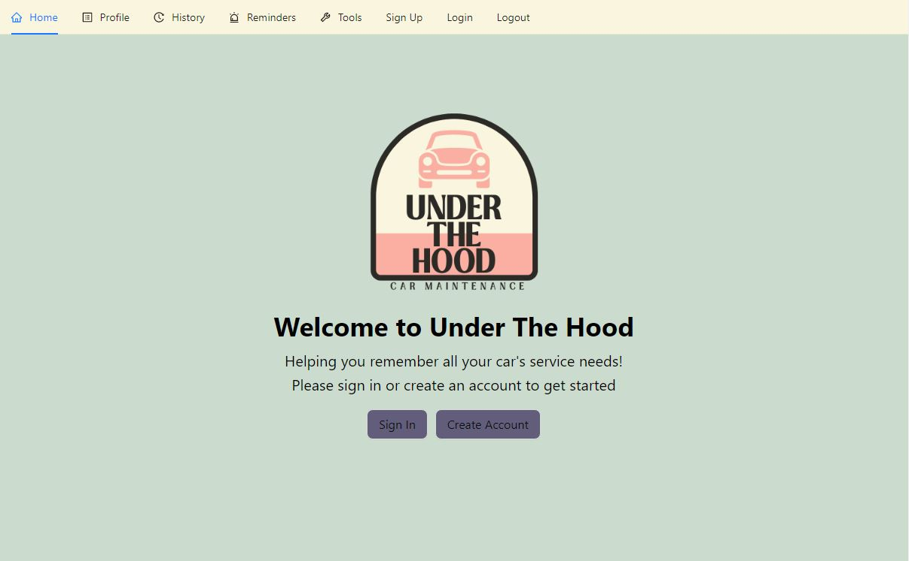
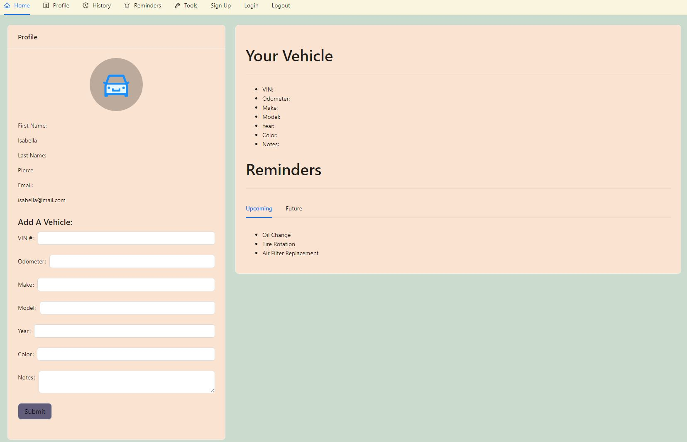
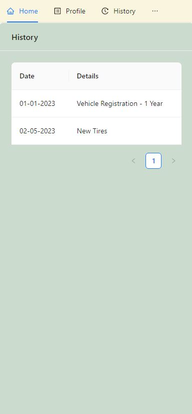

# Under The Hood

## Description

A vehicle maintenance reminder, tracking and scheduling application. Under the Hood is designed to allow users to create a login, add their vehicle information, set up reminders for needed service and maintenance tasks, and store a history for each vehicle. It is a React app built using Node.js, MongoDB, Express.js, Apollo, GraphQL, JWT, and Ant Design.  

## Table of Contents

- [Installation](#installation)
- [Usage](#usage)
- [Credits](#credits)
- [License](#license)

## Application Prep

**Prerequisites** Install this application on a server with Node.js and Express.js already installed. VS Code was used during development.

In the Top Level Folder
- `npm install --save-dev concurrently`

In the /client directory
- `npm install @apollo-client graphql jwt-decode`

In the /server directory
- `npm install --save-dev nodemon`
- `npm install apollo-server-express bcrypt express graphql jsonwebtoken mongoose`

**NOTE** The above steps were used to install dependencies during app development.  These steps should *not* be necessary to install and run this application.  See *installation* steps below for setting up the application for your own use.

## Installation

After you clone the repository...

- From the top Level folder, open a terminal window and run `npm run install`.  This will install all dependencies for the top level, as well as the /client and /server.

- From the same location, run `npm run develop` to start both client and server applications simultaneously in Development mode.

## Usage

After you have installed this repo and installed it you can run this on `localhost:3000` by running `npm run develop` in the root of the repo or you can visit our deployed page at the link below.  
After first loading in you will be directed to the homepage: 
 
Once you have signed up, your profile page is where you can add a vehicle to your profile, see the vehicles you have already added and upcoming / future reminders. 
 
Under the Hood is also a mobile friendly site! 

Under the Hood has been deployed using Heroku. You can try it out as a user by clicking this [Link](https://under-the-hood.herokuapp.com/).

## Credits

The following individuals worked together to create this application:

- [Maggie Delaney](https://github.com/maggierdelaney)
- [Isabella Pettini](https://github.com/isabella-pettini)
- [Parker Scully](https://github.com/Pscully21)
- [Jessica Oboh](https://github.com/JessicaOB)
- [Sean Collins](https://github.com/iseanc)

## License

MIT license. Click the license badge at the top for license details.

## Questions

For questions regarding this project the names in the credits section link to the individuals' github profiles or you may use the emails below.
* Maggie Delaney - margaretrdelaney@gmail.com
* Isabella Pettini - isabellapierce93@gmail.com
* Parker Scully - pscully05@gmail.com
* Jessica Oboh - jessb216@gmail.com
* Sean Collins -  iseanc@hotmail.com
